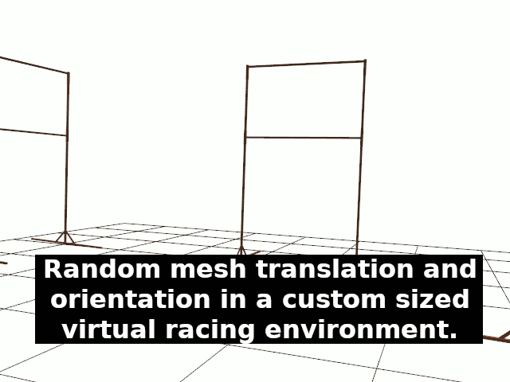

# Hybrid Dataset Factory

##### A semi-synthetic dataset generation tool, specifically crafted for training CNNs used in autonomous drone racing.



## Description

Collecting a large dataset for the specific case of autonomous drone racing can be a tedious and long process, especially for the images annotation if you need to know the gates position or orientation relative to the camera.

This tool aims to automate the main part of this task, by generating 3D projections of a given mesh in a virtual space, which can be adjusted to your physical space dimensions. Such projections are then overlaid on top of randomly selected images from a given base dataset, which must be annotated with camera poses and orientations for the virtual camera to be aligned properly.

The output is a collection of images along with a JSON file containing per-image annotations, such as:

- The bounding box of the gate in pixel coordinates
- The gate rotation in degrees
- The gate visibility on the image (boolean)

## Usage

Running `dataset_factory.py -h` with Python3 returns the following:

```
usage: dataset_factory.py [-h] [--count NB_IMAGES] [--res RESOLUTION]
						  [-t THREADS] --camera CAMERA_PARAMETERS [-v] [-vv]
						  [--seed SEED] [--blur BLUR_THRESHOLD]
						  [--noise NOISE_AMOUNT] [--no-blur]
						  [--max-gates MAX_GATES] [--min-dist MIN_DIST]
						  mesh dataset annotations dest

Generate a hybrid synthetic dataset of projections of a given 3D model, in
random positions and orientations, onto randomly selected background images
from a given dataset.

positional arguments:
mesh                  the 3D mesh to project
dataset               the path to the background images dataset
annotations           the path to the CSV annotations file, with
					  height, roll, pitch and yaw annotations
dest                  the path to the destination folder for the generated
					  dataset

optional arguments:
-h, --help            show this help message and exit
--count NB_IMAGES     the number of images to be generated
--res RESOLUTION      the desired resolution (WxH)
-t THREADS            the number of threads to use
--camera CAMERA_PARAMETERS
					  the path to the camera parameters YAML file
					  (output of OpenCV's calibration)
-v                    verbose output
-vv                   extra verbose output (render the perspective grid)
--seed SEED           use a fixed seed
--blur BLUR_THRESHOLD
					  the blur threshold
--noise NOISE_AMOUNT  the gaussian noise amount
--no-blur             disable synthetic motion blur
--max-gates MAX_GATES
					  the maximum amount of gates to spawn
--min-dist MIN_DIST   the minimum distance between each gate, in meter
```


At the bottom of the file, you are free to set the virtual environment
boundaries, which should match your real environment in which you recorded the
base dataset.

```
datasetFactory.set_world_parameters(
	{'x': 10, 'y': 10}, # Real world boundaries in meters (relative to the mesh's scale)
)
```

The output dataset's file structure will look like this:

```
dataset/
	images/
		0001.png
		0002.png
		...
	annotations.csv
```

### Base dataset

The dataset used as background images (most likely your target environment) must
have been taken with the same camera as the one described in your camera paremeters
YAML file (on which you ran OpenCV's calibration).
Each image must be annotated in one CSV file, as follow:

```
frame,translation_x,translation_y,translation_z,rotation_x,rotation_y,rotation_z,rotation_w,timestamp
 0000_629589728.jpg,-5.37385128869,-0.881558484322,0.159263357637,-0.00440469629754,-0.000679782844326,0.0768049529211,0.997036175749,0000_624666278
 0000_662663330.jpg,-5.37385683996,-0.881637914771,0.159261395553,-0.0044149173031,-0.000628436278144,0.0767958666096,0.997036864135,0000_664726891
 0000_695997989.jpg,-5.37384244682,-0.881571194016,0.159243845072,-0.00446504952991,-0.000594139084393,0.0768650390116,0.997031331558,0000_694637474
```

To provide such annotations, you can use the `extract_frame_pose.py` utility scrtipt (in `utils/`),
which extracts and synchronizes image frames along with drone poses from a [ROS](http://www.ros.org/) bag file.
One can use a motion capture system (e.g. Vicon) to record the drone pose and orientation
in the racing environment, and record a bag file while subscribing to the camera
and motion capture system topics on [ROS](http://www.ros.org/).

The file structure of the base dataset must look like this (the annotations file can, however, be located elsewhere):

```
background_dataset/
	0001.png
	0002.png
	...
	annotations.csv
```

### 3D Mesh

A custom racing gate model is provided in the `meshes/` folder, along with its
texture, but it is up to you to use whichever OBJ file you desire.  Do know that
the scale you use for your model must be in accordance with the scale you
provide in your base dataset annotations.

A YAML file is also given as example for the configuration of each model. This
one follows the usage of the script, and tells where the center of the gate is
(from the mesh's coordinate system), what its width and height are and what
texture to use.

### Requirements

The following Python3 packages are required (using an Anaconda environment is recommended):

- numpy
- argparse
- opencv-python
- tqdm
- PIL
- skimage
- pyrr
- numpy-quaternion
- ModernGL
- ModernGL.ext.obj
- PyYAML

## Roadmap

- [x] Thread it!
- [x] Random positioning of the gate
- [x] Boundaries definition for the gate (relative to the mesh's size)
- [x] Compute the center of the gate
- [x] Compute the presence of the gate in the image frame
- [x] Convert world coordinates to image coordinates
- [x] Compute the distance to the gate (needed?)
- [x] Perspective projection for visualization
- [x] Camera calibration (use the correct parameters)
- [x] Project on transparent background
- [x] Overlay with background image
- [x] Model the camera distortion
- [x] Save generated dataset online in a separate thread
- [x] Add background gates
- [x] Compute gate visibility percentage over the whole dataset
- [x] Compute gate orientation with respect to the camera
- [x] Ensure that the gate is always oriented towards the camera (for the annotation)
- [x] Save annotations
- [ ] Refactor DatasetFactory (create augentation class)
- [ ] Refactor SceneRenderer (use an interface to let users script their scene)
- [ ] Apply the distortion to the OpenGL projection
- [x] Add variation to the mesh and texture
- [x] Motion blur
- [x] MSAA anti alisasing
